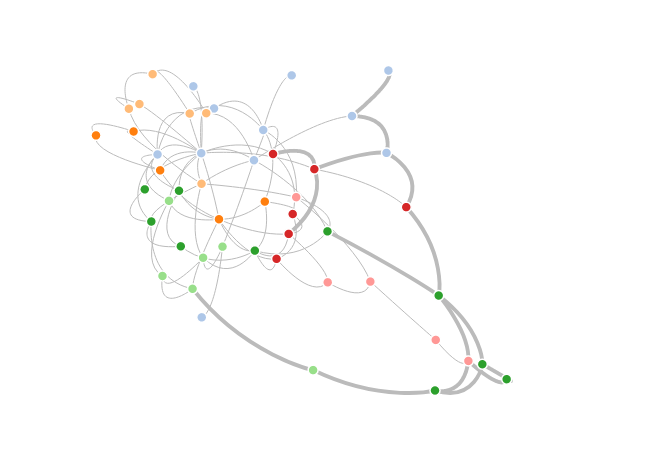
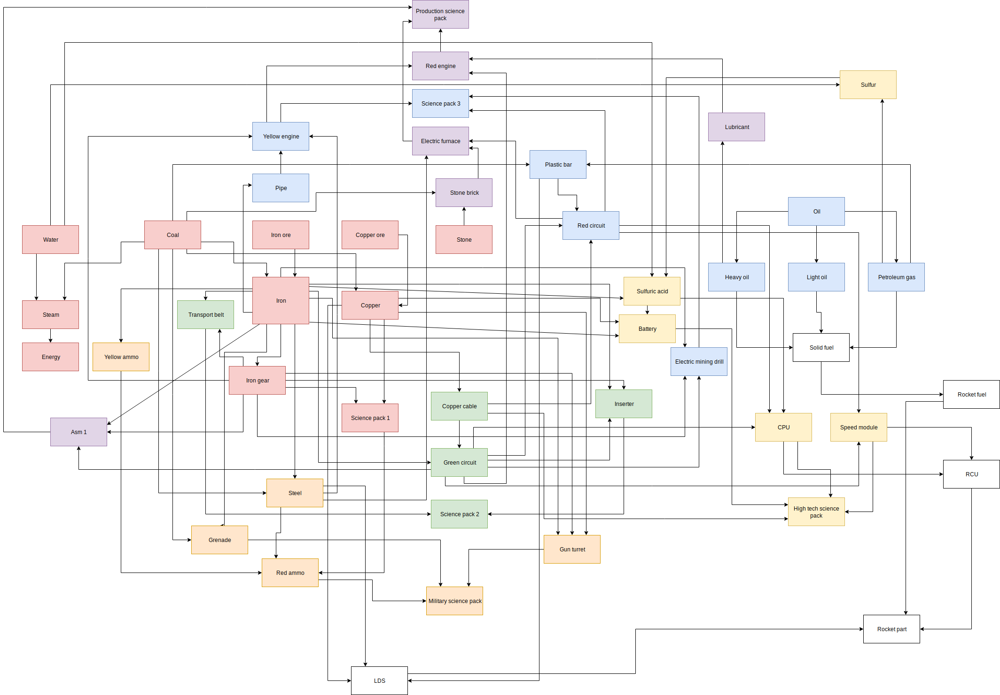

# factorio-schematics

Some production schemas for Factorio, the game about automation.

* `paper/` - a simple hand-drawn schema. Made using [draw.io](https://draw.io). Load the XML into draw.io to edit;
* `graph/` - the same schema, this time implemented as D3 force-directed graph. An attempt to find the ideal factory shape.

